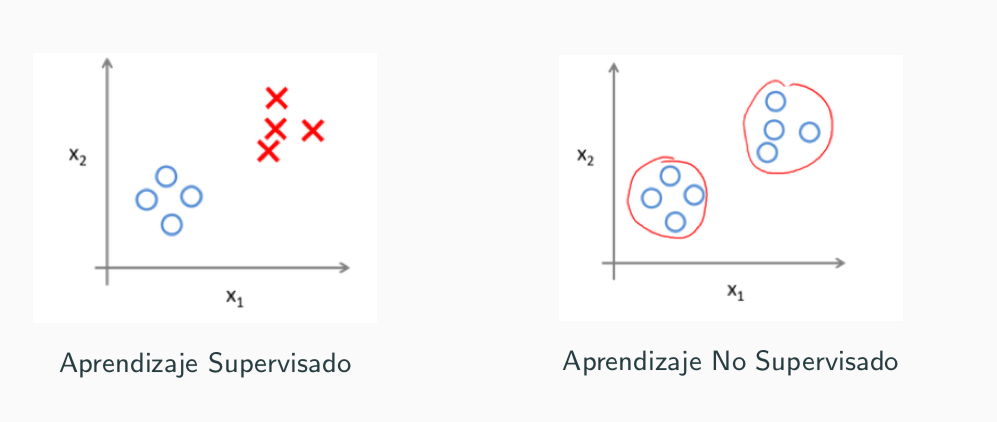
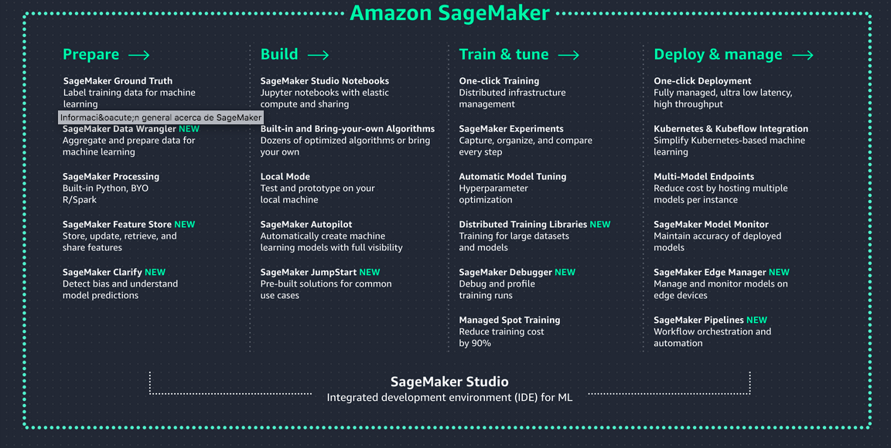
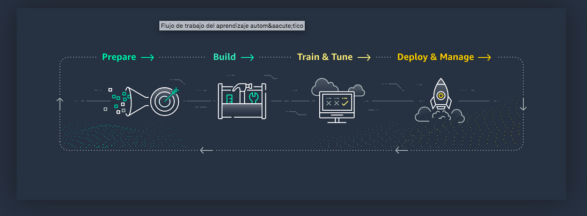
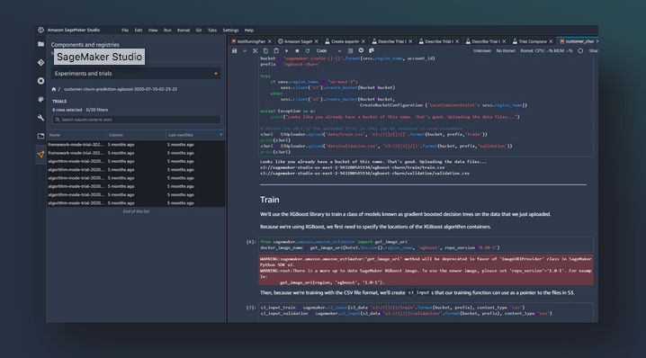

# Amazon Sagemaker

---

## Machine Learning

- Aprendizaje automático o aprendizaje automatizado o aprendizaje de máquinas 
- Del inglés, machine learning.
- En el aprendizaje de automatioc un software observa datos, construye un modelo basado en esos datos y utiliza ese modelo a la vez como una hipótesis acerca del mundo.
- Nos puede servir para predecir o para analizar esos datos.

---

- Aprendizaje Supervisado: Los ejemplos vienen con una variable de salida o etiqueta que queremos aprender.
- Aprendizaje No Supervisado: No existe una variable o concepto objetivo. Nos interesa descubrir patrones o relaciones que expliquen los datos.

---

# k-nn

- El método de los k vecinos más cercanos (en inglés, k-nearest neighbors, abreviado k-nn es un método de clasificación supervisada.

---

- La fase de entrenamiento del algoritmo consiste en almacenar los vectores de caracterisitcas y las etiquetas de los ejemplos de entrenamiento. 
- En la fase de clasificación o regresión, la evaluación del ejemplo (del que no se conoce su clase o valor) es representada por un vector en el espacio característico. 
- Se calcula la distancia entre los vectores almacenados y el nuevo vector, y se seleccionan los  k ejemplos más cercanos.
- El nuevo ejemplo es clasificado con la clase que más se repite en los vectores seleccionados o el valor de la regresión toma la media de los k valores más cercanos.
---

- Amazon SageMaker ayuda a los científicos de datos y a los desarrolladores a preparar, crear, entrenar e implementar con rapidez modelos de aprendizaje automático de alta calidad 
- https://aws.amazon.com/es/sagemaker/

---

---

---

# SageMaker Studio

---

# DEMO
---

# Docs
- https://docs.aws.amazon.com/es_es/sagemaker/latest/dg/gs.html
- https://sagemaker-examples.readthedocs.io/en/latest/index.html
- k-nn: https://docs.aws.amazon.com/es_es/sagemaker/latest/dg/k-nearest-neighbors.html

