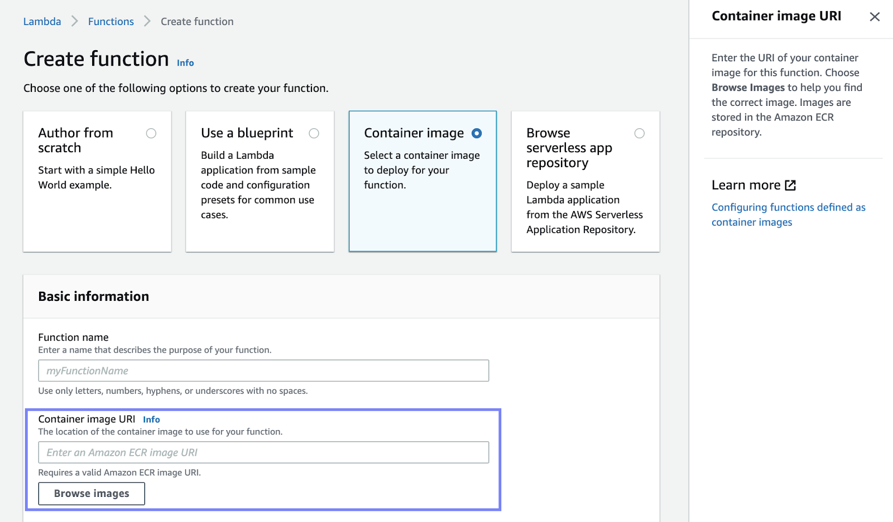

<style>
img[alt~="center"] {
  display: block;
  margin: 0 auto;
}
</style>

# Despliege de funciones lambda con Docker

---

- Hasta hace poco la unica manera de desplegar una función lambda estaba limitada a un paquete zip.
- Esto tenia alugunas limitaciones como por ejemplo si queremos instalar alguna utilidad a nivel de sistema.
- Ahora podemos desplegar una función lamnda mediante una imagen docker:


---

Para ello necesitamos crear los siguientes ficheros:
```bash
- app.py
- dockerfile
- requirements.txt 
```

---

## app.py
```python
def handler(event, context):
    return 'Hola'
```

---


## dockerfile
```dockerfile
FROM public.ecr.aws/lambda/python:3.8

# Copy function code
COPY app.py ${LAMBDA_TASK_ROOT}

# Install the function's dependencies using file requirements.txt
# from your project folder.

COPY requirements.txt  .
RUN  pip3 install -r requirements.txt --target "${LAMBDA_TASK_ROOT}"

# Set the CMD to your handler (could also be done as a parameter override outside of the Dockerfile)
CMD [ "app.handler" ]
```

---

## Test
- Podemos testear la función localmente.

```bash
docker build -t random-letter .

docker run -p 9000:8080 random-letter:latest

curl -XPOST "http://localhost:9000/2015-03-31/functions/function/invocations" -d '{}'
```

---

## Despliege:


- Para desplegar la función primero creamos un nuevo repositorio en nuesto ECR:
```bash
aws ecr create-repository --repository-name repository-name --region region
```
- Tageamos nuestra imagen.
```bash
docker tag hello-world aws_account_id.dkr.ecr.region.amazonaws.com/repository-name
```
- Logeamos docker
```bash
aws ecr get-login-password | docker login --username AWS --password-stdin aws_account_id.dkr.ecr.region.amazonaws.com
```
- Hacemos un push de la imagen.
```bash
docker push aws_account_id.dkr.ecr.region.amazonaws.com/repository-name
```

---

- Para terminar creamos una nueva función lamnda desde la consola de aws usando la imagen que acabamos de subir al ECR.



---

- Tambien se puede realizar la actualización con un comando:
```bash
aws lambda update-function-code --region eu-west-3 --function-name funDocker --image-uri aws_account_id.dkr.ecr.region.amazonaws.com/repository-name
```

---

# Ejercicio

- Usando el código de ejemplo de esta presentación crea una función lambda y despliegala usando una imagen docker.

